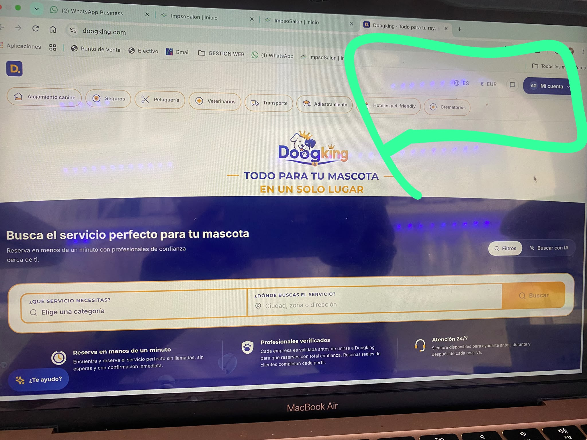

- En la sección del home: Servicios cerca de ti, analiza que salgan fotos reales relacionadas con los lugares mensionados. 
- En los servicos por ejemplo: /alojamiento/6aa45f57779263b987ae2409, cuando le den clic a un producto, como tipo de espacio, que vaya directo a reservar.
- Analiza e implementa la solición a estos errores: 

[4:43 a. m., 1/10/2026] +34 678 59 07 05: También he comprobado el planificador: permite generar un viaje dejando fechas y presupuesto vacíos, y después muestra importes como si fueran el coste del viaje. Además propone una residencia canina como “dónde dormir” en una escapada para viajar junto al perro, en vez de un hotel pet-friendly. Eso puede confundir mucho y lo marcaré como bloqueo antes del lanzamiento.
[4:44 a. m., 1/10/2026] +34 678 59 07 05: Ya han aparecido varios problemas de lanzamiento importantes en alojamiento: una dirección rota (1, 1, , Valencia), valoraciones “0 · Correcto” sin reseñas, precios distintos entre listado y ficha y una explicación interna dirigida al negocio que se muestra al cliente. También revisaré que el precio no pueda alterarse desde la URL antes de cobrar, porque actualmente viaja como parámetro modificable. Continúo con los demás servicios antes de darte conclusiones definitivas.
[4:44 a. m., 1/10/2026] +34 678 59 07 05: encontrado un bloqueo legal claro: la página pública de condiciones muestra literalmente “Borrador sin publicar” y hasta el nombre interno del archivo técnico donde faltan los datos de la empresa. Esto no puede quedar visible al salir al mercado. Revisaré ahora todas las páginas legales para comprobar si el problema se repite.

- Analiza y arregla todo el proceso del alta del perro en /perros/nuevo, em modile, no se puede completar todo, y se ve todo bien apretado en mobile, por ejemploe en el paso 3, están apretados y pegadas algunas secciones, y la sección Miedos tiene un selector, que no se ve por el overflow. 

- El botón de te ayudo, en algunas secciónes tapa información, mejora, o evalua ponerlo en el header, que se vea bien en todas las resoluciones, y también en mobile, cuando le das clic aparece arriba a la izquierda el chat. debe aparecer donde le das clic. 

- quita el botón "Ver en google maps", en el detalle del comercio. ejemplo: /alojamiento/6aa84723d91709ec542d1379

- El agente de te ayudo, cuando ponga cosas relacionadas con los servicios de doogking, que les de la opciones en el chato, por ejemplo cuando diga, Alojanmiento en valencia, le salgan las opciones de alojamiento con los botones para ir a esos comercios dentro de la plataforma. 

- En fichas de los perros falta poder poner el número de chip

- en veterinarios, que no aparezca el motivo principal. 

- Revisa todos los documentos legales y de terminos y condicioones, politicas etc, y completalos todos, info: 

 Nombre legal: DOOGKING, S.L. (EN CONSTITUCIÓN)
* Nombre comercial: Doogking
* NIF: pendiente
* NIF-IVA: dejar vacío
* País: España
* Domicilio: Calle Doctor Roux, 10
* Apartamento, bloque u otro: Bajo
* Código postal: 12004
* Ciudad: Castellón de la Plana
* Provincia: Castellón
 Datos de contacto del representante:
* Nombre legal: Alexandra Miguelina
* Apellidos: Germán Evangelista
* Correo electrónico: info@doogking.com
* Cargo: Socia fundadora
* Fecha de nacimiento: 28/03/1991
* País: España
* Domicilio: Calle Sanz de Bremond, 19
* Apartamento, bloque u otro: Piso 2, puerta 1
* Código postal: 12004
* Ciudad: Castellón de la Plana
* Provincia: Castellón
 propietarios o directores de la mepres:
* Nombre legal: Edgar
* Apellidos: Benedicto Tormos
* Correo electrónico: su correo personal o info@doogking.com
* Fecha de nacimiento: 14/02/1985
* País: España
* Domicilio:C/Andalucía 49
* Código postal: 12540 
* Ciudad: Vila-real
* Provincia: Castellón

- En el agente de IA te ayudo, Se supone que se registraron playas u parques caninos y dice que no hay, acutlaiza la información de toda la página, para que pueda encontrarlos. 

- En planificador de viajes no te permite poner el lugar

- En la cuenta de comercio en mis servicios, las opciones de cada servicio (tres puntos), que estén siempre visiblen al finar de cada card. 

- En la configuración de comercio, cambia "Compatibilidad social que admites" por "Marca los perfiles que no admites en tu centro canino"

- Está imagen es más completa para el servicio de alojamiento, pues hay centros que no ofrecen noche u ofrecen los dos servicios.  Se tiene que crear la plantilla para que las empresas puedan vender también el servicio de guardería de día: 

- A la hora de hacer una reserva en un horario fuera del que atiende el comercio, deja realizar el pago sin una alerta que impida seguir avanzando,dado que ese día está cerrado. O que de otra opción de recogida y entrega su alguno de los seleccionados está cerrado o fuera de horario

- revisa las urls para los comercios y los clientes deben ser amigables. Revisa bien, y luego del cambio comprueba que funcionen. 

- En la ficha del pero analiza y considera esto: 

[4:54 a. m., 1/10/2026] +34 678 59 07 05: En ciertos pasos tendría que dar la opción de hablar bien del perro sino hay un problema. ejemplo. Esta pantalla en aún alojamiento debería poner también . : es muy bueno !  ( Eso alegra solo de tocarlo y es más positiva la experiencia)
[4:55 a. m., 1/10/2026] +34 678 59 07 05: O si eso se refiere al tipo de pelo. Lo valoramos como poner o que poner en estado del manto
[4:55 a. m., 1/10/2026] +34 678 59 07 05: Tipos de manto. Pone normal solo. Se tiene que desplegar las diferentes opciones. Largo, corto, duro, doble capa, etc...

- en la barra superior de categorías nos queda demasiado espacio en blanco a la derecha y visualmente parece que la cabecera está incompleta. Nos gustaría aprovecharlo añadiendo "Explora con tu mascota" después de Crematorios, con un icono que destaque ligeramente, y redistribuir los elementos para que ocupen mejor todo el ancho de la pantalla. La idea es que quede equilibrado también en diferentes tamaños de ordenador.: 

- analiza la indexación, la parte SEO que sea muy seo optimizada. 

